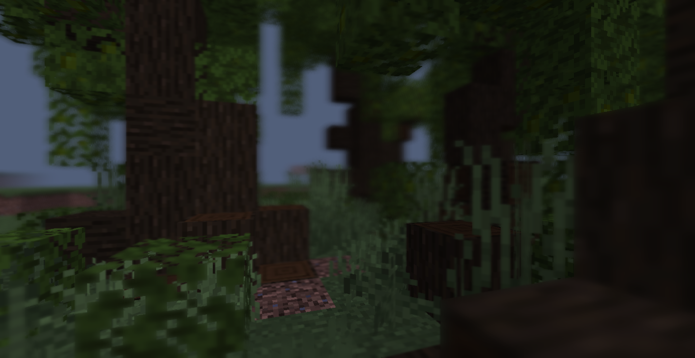
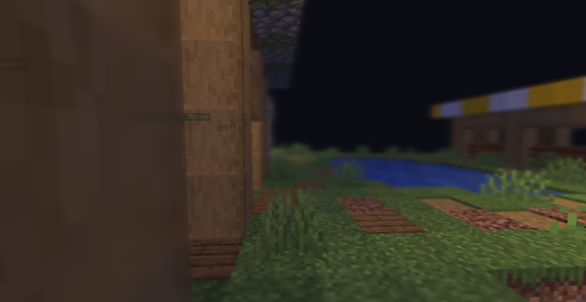
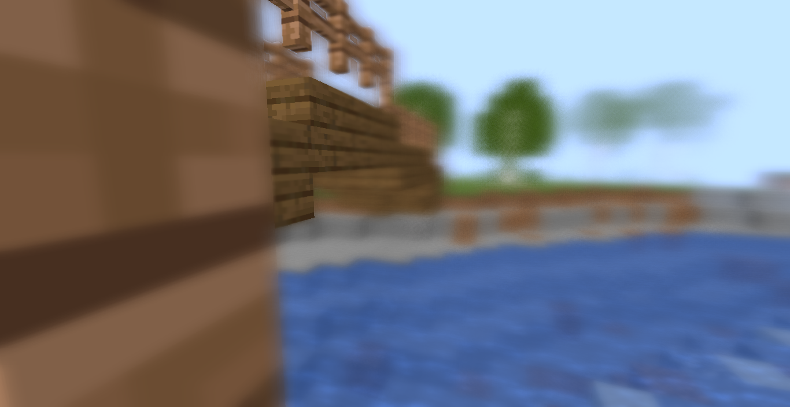

# Blurry Focus
Post process shader that add blurs!

## Using this resourcepack
To use this resourcepack, you need Minecraft 1.17 (or higher, idk). You also need to set your graphics quality to _Fabulous_ (that mean you can cycle between no blur and blur shader without removing resourcepack)

## Showcases

